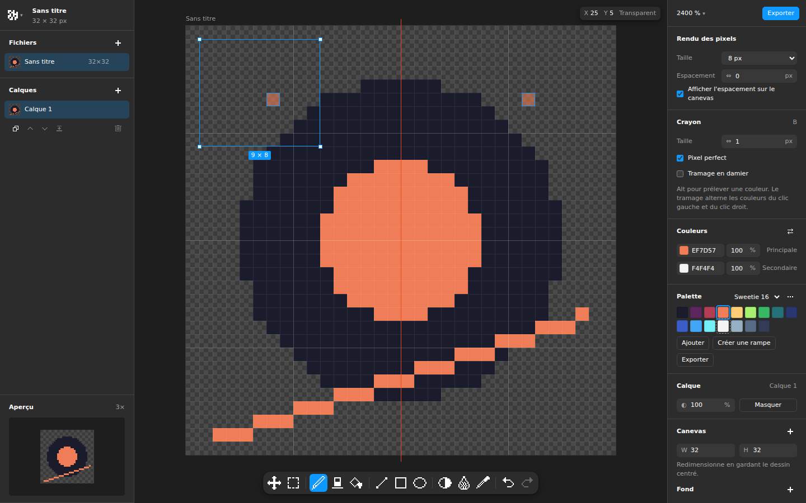

# Baipix

**A pixel art editor for designers, with the interface of a modern design tool.** Free, open source, runs in the browser, no account needed.



## Features

- **Drawing tools:** pencil with pixel-perfect mode, eraser, line, rectangle, ellipse (outline or filled), paint bucket (contiguous or global), selection and move, eyedropper.
- **Palette-aware tools:** shading picks the next lighter or darker palette color in OKLab; blur can snap its result back to the palette.
- **Palettes:** Sweetie 16, PICO-8, Endesga 32, Game Boy… Paste any Lospec palette, build one from your drawing, or generate hue-shifted ramps.
- **Layers, multiple files, symmetry, tile preview, checkerboard dithering.**
- **Rendering for design work:** choose the exported pixel size and a gap between pixels (LED / dot-matrix look), previewed live on the canvas.
- **Export:** PNG, clean SVG (one path per color, merged runs), **copy as SVG to paste straight into Figma or Illustrator**, `.baipix` project files, Lospec `.hex` palettes.
- **Local-first:** everything is saved in your browser (IndexedDB). Nothing is sent anywhere.
- English and French.

## Getting started

```bash
npm install
npm run dev        # http://localhost:5173
```

| Script                 | What it does                                            |
| ---------------------- | ------------------------------------------------------- |
| `npm run dev`          | Development server with hot reload                      |
| `npm test`             | Unit tests (Vitest)                                     |
| `npm run typecheck`    | TypeScript checks                                       |
| `npm run lint`         | ESLint                                                  |
| `npm run build`        | Production build in `dist/`                             |
| `npm run build:single` | One self-contained `dist/index.html`, handy for sharing |

## Architecture

Baipix is split in two: a pure **engine** that knows nothing about the DOM, and a **React UI** on top of it.

```
src/
├── engine/        Pure TypeScript, fully unit-tested, no DOM
│   ├── editor.ts      State, commands, history, notifications (the only entry point for the UI)
│   ├── document.ts    Documents and layers
│   ├── tools/         One file per tool
│   ├── raster.ts      Lines, ellipses, flood fill, symmetry, pixel-perfect
│   ├── palette.ts     Presets, OKLab shading, ramps
│   ├── composite.ts   Layer blending
│   └── export/svg.ts  SVG export
├── storage/       .baipix file format, IndexedDB, StorageAdapter interface
├── io/            Browser I/O: downloads, PNG, clipboard, image import
├── i18n/          en.ts (source) and fr.ts
└── ui/            React components, panels, dialogs, canvas renderer
```

More details in [docs/ARCHITECTURE.md](docs/ARCHITECTURE.md).

## Contributing

Contributions are welcome, from bug reports to new tools. Read [CONTRIBUTING.md](CONTRIBUTING.md) to get started: adding a tool or a language is a good first contribution.

## License

[MIT](LICENSE)
